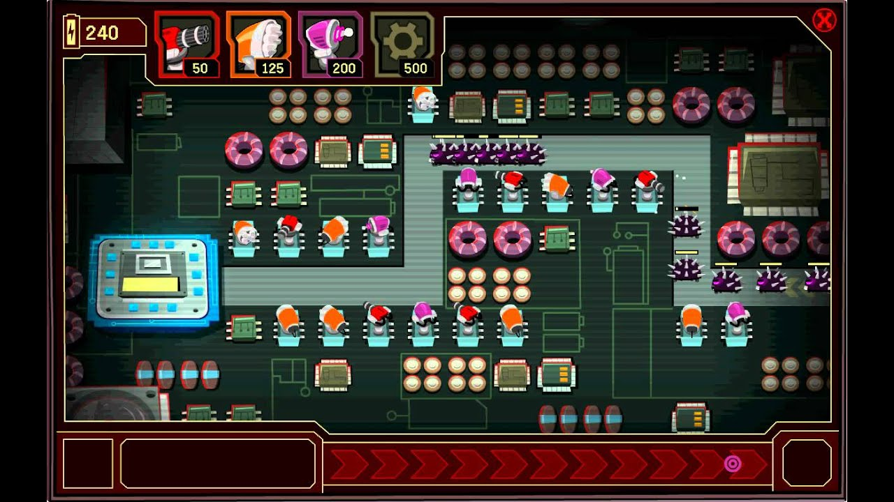

# Tower Defense Game

---
title: Relatório Computação Gráfica
author:
  - Luís Pedro de Sousa Oliveira Góis, nº 2018280716
date: \today
---

## Overview

This is a Tower Defense game developed using OpenGL, where players
strategically place cannons to defend against waves of incoming enemies. Players
need to plan their defenses carefully to survive increasingly challenging
opponents.

This game was heavily inspired on the Club Penguin Mini-game System Defender.



## Game Mechanics

### Objective

The primary goal of the game is to prevent enemies from reaching your tower by
strategically placing cannons along their path.

### Cannons

```c++
struct CannonStats {
	Color color;
	CooldownMs cooldownMs;
	HealthPoints damage;
	Range range;
	HealthPoints cost;
};
```

- **Types of Cannons**:
  1. Tier A: Faster but worst damage and worst range
  2. Tier B: Long Range but middle damage and rate
  3. Tier C: Most Damage but worst rate and less range

- **Upgrading Towers**: Players can spend resources to upgrade cannons,
  increasing their damage and range.

### Enemies

```c++
struct EnemyStats {
	Color color;
	HealthPoints health;
	Speed speedUpMs;
};
```

- **Types of Enemies**
  - Tier A: Fastest but less health
  - Tier B: Fast but average health
  - Tier C: Slow but more health

### Waves

- Enemies spawn in waves, with each wave becoming progressively more difficult.
  Players must survive a set number of waves to win the game.

### Resources

- Players earn resources by defeating enemies, which can be used to build new
  cannons and upgrade existing ones.

### Game Over Conditions

- The game ends when the tower is destroyed.

## Input Events

### Keyboard Controls

| Key             | Action                                              |
| --------------- | ---------------                                     |
| W/Up            | Move selected position Up                           |
| S/Down          | Move selected position Down                         |
| A/Left          | Move selected position Left                         |
| D/Right         | Move selected position Right                        |
| 1               | Place Cannon at selected position of tier A         |
| 2               | Place Cannon at selected position of tier B         |
| 3               | Place Cannon at selected position of tier C         |
| 4/U             | Upgrade Cannon at selected position                 |
| I               | Print Info at selected position (debug mode).       |
| C               | Toggle between cull face modes (opengl debug mode). |
| T               | Toggle between polygon modes (opengl debug mode).   |
| V               | Switch between views                                |
| M               | Focus Minimap                                       |
| P               | Pause Game                                          |
| R               | Reset view and minimap focus to default             |

#### Views

1. Default View (perspective of field)
2. Orbit around the field

After that, if you keep pressing v it will show a first person perspective from each enemy.

## Installation

1. Build and run without [OpenFrameworks](https://openframeworks.cc/)
```sh
make --file=Makefile -j4 run
```
2. Build with [OpenFrameworks](https://openframeworks.cc/)
```sh
make -j4 && make run
```
